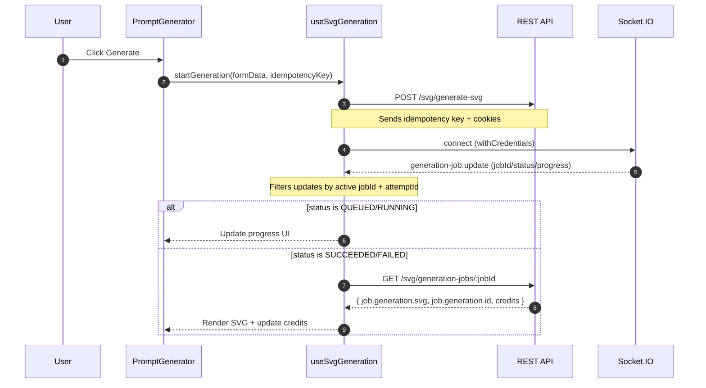
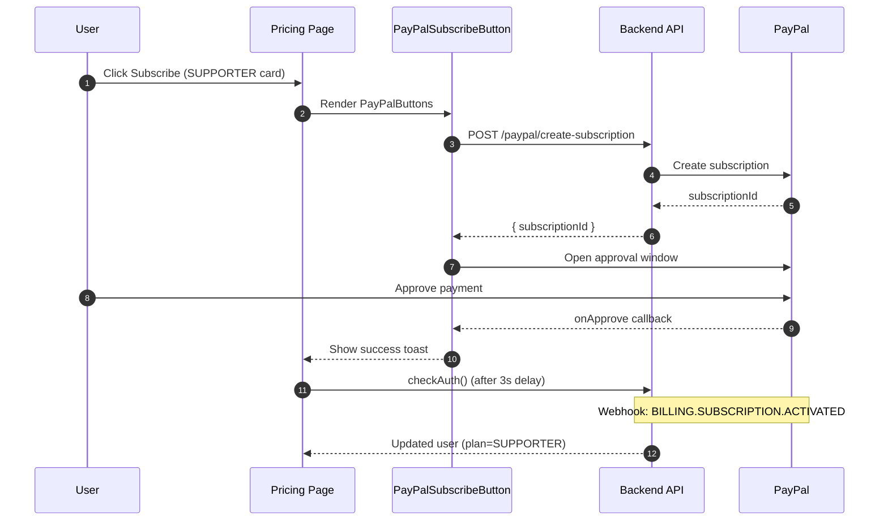

# Frontend Architecture

This document describes the **frontend (this repo)** architecture and runtime flows for chatSVG.

- **Production:** https://chatsvg.dev
- **API:** https://api.chatsvg.dev
- **Backend/infrastructure:** documented in the server repository.

## Runtime Overview

```mermaid
flowchart TB
  Browser[User Browser] --> Router[React Router]
  Router --> Layout[App Layout\n`src/App.tsx`]

  Layout --> Auth[AuthProvider\n`src/context/AuthProvider.tsx`]
  Layout --> Notifs[NotificationsProvider\n`src/context/NotificationsProvider.tsx`]
  Layout --> Toast[ToastProvider\n`src/context/ToastProvider.tsx`]
  Layout --> Sentry[Sentry init\n`src/services/logger.ts`]

  Layout --> Pages[Pages\n`src/pages/*`]
  Pages --> Dashboard[Dashboard\n`src/pages/Dashboard.tsx`]
  Dashboard --> Prompt[PromptGenerator\n`src/components/PromptGenerator.tsx`]

  Prompt --> Hook[useSvgGeneration\n`src/components/promptGenerator/useSvgGeneration.ts`]
  Hook --> SvgSvc[svgService\n`src/services/svgService.ts`]
  SvgSvc --> Axios[Axios client\n(withCredentials + CSRF)]

  Hook --> Socket[socket.ts\n`src/lib/socket.ts`]
  Socket --> SIO[Socket.IO connection\n(same origin as API)]

  SvgSvc --> REST[REST API\n`/svg/*`]
  SIO --> Events[Socket events\n`generation-job:update`]

  Hook --> Modal[SvgResultModal\n`src/components/modal/SvgResultModal.tsx`]
  Modal --> Download[Download flow\n(signed URL → fetch blob)]
```

## App Boot & Providers

Entry point: `src/main.tsx`

- Initializes Sentry via `initSentry()`.
- Wraps the app with:
  - `AppErrorBoundary` (top-level error boundary)
  - `PayPalScriptProvider` (PayPal JS SDK — vault mode, subscription intent)
  - `AuthProvider` (session bootstrap + user state)
  - `AuthCapabilitiesProvider` (OAuth provider discovery)
  - `NotificationsProvider` (badge count + dropdown list state)
  - `ToastProvider` (toast notifications)
  - `RouterProvider` (`src/routes/index.tsx`)

See `docs/NOTIFICATIONS.md` for the Notifications v1 feature.

### Auth bootstrap

`AuthProvider` (`src/context/AuthProvider.tsx`) is responsible for:

- CSRF bootstrap (`bootstrapCsrf()`) for cookie-based auth.
- Ensuring a valid session (`ensureSession()`), then fetching the current user.
- Connecting/disconnecting Socket.IO based on authentication:
  - when authenticated → `setupSocket()`
  - when unauthenticated → `disconnectSocket()`

`App.tsx` uses `useAuth()` and shows a loading screen while auth bootstrap is in progress.

## Routing

Routes are defined in `src/routes/index.tsx`.

- `/` → `Home` (landing page)
- `/app` → `Dashboard`
- `/pricing` → `Pricing` (plan cards + PayPal subscribe)
- `/signin` `/signup` → auth pages
- `/auth/callback` → OAuth callback handler
- `/billing/paypal/success` `/billing/paypal/cancel` → `PayPalReturn`
- `*` → `NotFound`

## API & Realtime (Socket.IO)

### HTTP client

`src/services/svgService.ts` uses Axios configured with:

- `baseURL: VITE_API_BASE_URL || '/api'`
- `withCredentials: true` (cookie-based auth)
- CSRF interceptor (`attachCsrfInterceptor`) for protected endpoints

### Socket origin

`src/lib/socket.ts` derives the Socket.IO origin from `VITE_API_BASE_URL`:

- If `VITE_API_BASE_URL` is absolute (starts with `http`) → uses its origin.
- Otherwise falls back to `window.location.origin`.

This ensures HTTP and Socket.IO traffic go to the same backend origin.

## SVG Generation Flow (WS-driven)

The frontend uses a hybrid flow:

- **POST** to start the job
- **Socket.IO** events for live progress
- **Final GET** on terminal state to fetch the finished SVG + credits



### State ownership

`useSvgGeneration` owns modal state and guards against stale updates:

- Uses a per-attempt stable modal `key` so React doesn’t remount the modal mid-flight.
- Uses refs to ignore updates from previous attempts and only apply updates for the active job.

## Download Flow (Signed URL)

When a generation is completed, the modal receives a `generationId`.

`SvgResultModal` (`src/components/modal/SvgResultModal.tsx`) implements:

1. Frontend asks backend for a signed URL:
   - `GET /svg/:generationId/download` → `{ downloadUrl }`
2. Frontend downloads the SVG without opening a new tab:
   - `fetch(downloadUrl)` → `Blob` → `URL.createObjectURL(blob)`
   - triggers a download via an `<a download>` click.

Notes:

- This UX avoids opening S3 URLs in a new tab.
- If the frontend downloads via `fetch(downloadUrl)`, S3 must allow **CORS** for the frontend origin.
  - Alternative (backend-side proxy/stream) can avoid S3 CORS requirements.

## Payment / Subscription Flow (PayPal)

The frontend integrates `@paypal/react-paypal-js` for SUPPORTER plan subscriptions. The backend is the source of truth for plan state — the frontend never writes plan data directly.



### Key components

- `PayPalScriptProvider` (`main.tsx`) — loads PayPal JS SDK with `vault: true`, `intent: 'subscription'`
- `PayPalSubscribeButton` — calls backend to create subscription, passes `subscriptionId` to PayPal SDK
- `Pricing.tsx` — 4 CTA states: PayPal button (FREE → SUPPORTER), current plan + cancel (SUPPORTER), sign-in prompt (guest), default label (FREE card)
- `PayPalReturn.tsx` — landing page for `/billing/paypal/success` and `/billing/paypal/cancel` redirect URLs
- `paypalService.ts` — `createSubscription()`, `cancelSubscription()`, `getPayPalStatus()`

### Cancellation

SUPPORTER users see a "Cancel subscription" button on the Pricing page. It calls `POST /api/paypal/subscription/cancel`, shows a toast, and refreshes auth state.

## Error Handling & Observability

- `AppErrorBoundary` provides a top-level React error boundary.
- `logger` (`src/services/logger.ts`) integrates Sentry for production observability.
- Service errors normalize Axios error shapes into user-friendly messages.

## Testing

- Unit tests: `vitest`
- E2E tests: Playwright (see `tests/` and `.github/workflows/playwright.yml`)

## Environment Variables

| Variable               | Purpose                                                     | Example                     |
| ---------------------- | ----------------------------------------------------------- | --------------------------- |
| `VITE_API_BASE_URL`    | Backend API base URL (also used to derive Socket.IO origin) | `http://localhost:4000/api` |
| `VITE_PAYPAL_CLIENT_ID`| PayPal app client ID (sandbox or live)                      | `AU9Nbe_UkWk...`           |
| `VITE_SENTRY_DSN`      | Sentry DSN (optional)                                       | `https://...`               |
